  

## 🌊 VỀ BẢN THÂN & ĐỊNH HƯỚNG Y TẾ

Xin chào, tôi là **Phạm Hồng Đăng Khoa (Khoa Pham)**. Lấy cảm hứng từ sự bình yên, sâu lắng của biển cả (*Deep Navy & Ocean*), tôi dành nhiều thời gian nghiên cứu và xây dựng các hệ thống trí tuệ nhân tạo hướng tới hai lĩnh vực chính:

- **🩺 Y tế & Ngôn ngữ Lâm sàng (Healthcare AI & Clinical NLU)**: Phát triển các mô hình trích xuất thực thể bệnh lý, phân tích hồ sơ y khoa và hệ thống RAG tra cứu hướng dẫn lâm sàng có kiểm chứng dẫn chứng chặt chẽ, nói không với thông tin sai lệch hay ảo giác.
- **👁️ Thị giác Máy tính & Xử lý Tài liệu (Computer Vision & Document AI)**: Xây dựng các pipeline OCR bóc tách tài liệu, hóa đơn và đồng hồ đo chỉ số với chất lượng cao và khả năng tích hợp thực tế.

---

### 🏛️ Trọng tâm Nghiên cứu

<table>
<tr>
<td width="50%" valign="top">

### 🩺 Healthcare AI & Clinical Informatics
Hệ thống AI phục vụ chăm sóc sức khỏe với tính minh bạch và độ tin cậy cao:
- **Clinical Entity Extraction**: Nhận diện triệu chứng, bệnh án, tên thuốc từ văn bản lâm sàng.
- **Evidence-Grounded RAG**: Tra cứu tài liệu y khoa có đối chiếu nguồn tài liệu gốc.
- **Anti-Hallucination Barrier**: Rào chắn kiểm định sự thật, loại bỏ thông tin bịa đặt.
- **Patient Privacy**: Xử lý và làm sạch dữ liệu hồ sơ bệnh án tuân thủ chuẩn riêng tư.

</td>
<td width="50%" valign="top">

### 👁️ Computer Vision & Document Systems
Các giải pháp thị giác máy tính thực tế, chạy ổn định và chính xác:
- **Document Intake & Rectification**: Căn chỉnh góc nghiêng, nâng cao chất lượng ảnh hóa đơn/tài liệu.
- **Deep Text Localization**: Bóc tách vùng văn bản với mô hình PP-OCRv6.
- **Deterministic Validation**: Bộ luật kiểm tra ngữ pháp và đối soát số liệu tất định.
- **FastAPI Microservices**: Đóng gói API suy luận phục vụ ứng dụng thực tế.

</td>
</tr>
</table>

## 🔬 DỰ ÁN TIÊU BIỂU

  

### 🩺 Track 01 — Healthcare AI & Clinical Systems

<table>
<tr>
<td width="50%" valign="top">

#### [Medical-NLU-Pipeline](https://github.com/KwanFam26022005/Medical-NLU-Pipeline)
Hệ thống xử lý ngôn ngữ tự nhiên chuyên sâu cho miền y tế (Clinical NLU), phục vụ trích xuất thực thể bệnh lý, phân loại hồ sơ lâm sàng và đo kiểm trên các tập dữ liệu y khoa chuẩn.

`Python` · `Clinical NLU` · `Biomedical NLP` · `Evaluation`

</td>
<td width="50%" valign="top">

#### [tdtu-student-handbook-chatbot](https://github.com/KwanFam26022005/tdtu-student-handbook-chatbot)
Trợ lý tra cứu tri thức dựa trên RAG (Retrieval-Augmented Generation), tối ưu hóa tìm kiếm tài liệu theo quy chế đào tạo với độ chính xác cao và dẫn chứng ngữ cảnh rõ ràng.

`Python` · `RAG` · `Vector Search` · `Semantic Retrieval`

</td>
</tr>
<tr>
<td width="50%" valign="top">

#### KOA Agentic-RAG *(Clinical Research Prototype)*
Kiến trúc đa tác tử phục vụ tra cứu hướng dẫn lâm sàng đa bước: tự động phân rã câu hỏi y khoa phức tạp, kiểm tra đối chiếu tài liệu và thiết lập rào chắn chống ảo giác y khoa.

`Multi-Agent` · `Evidence Verification` · `Fact Auditing`

</td>
<td width="50%" valign="top">

#### [Interactive-Web-Dashboard-for-Frequent-Itemset-Mining](https://github.com/KwanFam26022005/Interactive-Web-Dashboard-for-Frequent-Itemset-Mining-and-Apriori-Pruning-Analysis)
Bảng điều khiển tương tác trực quan hóa thuật toán khai phá tập mục phổ biến và luật kết hợp Apriori, hỗ trợ phân tích dữ liệu và đánh giá hiệu năng.

`PHP` · `MySQL` · `JavaScript` · `ECharts` · `Apriori`

</td>
</tr>
</table>

### 👁️ Track 02 — Computer Vision & Document Intelligence

<table>
<tr>
<td width="50%" valign="top">

#### [Invoice-engine](https://github.com/KwanFam26022005/Invoice-engine)
Hệ thống tiếp nhận, bóc tách và chuẩn hóa hóa đơn chứng từ kinh doanh tiếng Việt chạy nội bộ (Local-first) với quy trình kiểm chứng dữ liệu tất định và tích hợp cơ sở dữ liệu DuckDB.

`Python` · `Document AI` · `DuckDB` · `Deterministic OCR`

</td>
<td width="50%" valign="top">

#### [meter-reading-engine-v2](https://github.com/KwanFam26022005/meter-reading-engine-v2)
Pipeline đọc chỉ số công tơ điện tử LCD hướng đến môi trường sản xuất với cổng kiểm soát chất lượng ảnh (Quality Gates), chỉnh lưu hình học và nhận diện số bằng PP-OCRv6.

`Python` · `Computer Vision` · `PP-OCRv6` · `Quality Gates`

</td>
</tr>
<tr>
<td width="50%" valign="top">

#### [meter-reading-inference-service](https://github.com/KwanFam26022005/meter-reading-inference-service)
Microservice suy luận đóng gói FastAPI cho lõi xử lý nhận diện, tích hợp kiểm tra phiên bản mô hình, probe trạng thái sẵn sàng và cơ chế từ chối khi không đạt chuẩn an toàn.

`Python` · `FastAPI` · `Inference API` · `Fail-Closed Design`

</td>
<td width="50%" valign="top">

#### [meter-reading-pipeline-visualizer](https://github.com/KwanFam26022005/meter-reading-pipeline-visualizer)
Giao diện đo lường và thanh tra trực quan từng giai đoạn xử lý của pipeline nhận diện, giúp theo dõi chi tiết chất lượng ảnh và tọa độ bóc tách ký tự.

`TypeScript` · `React` · `Telemetry` · `Pipeline Inspection`

</td>
</tr>
</table>

## 🛠️ NĂNG LỰC KỸ THUẬT

| Lĩnh Vực | Kỹ Năng & Công Nghệ |
|---|---|
| **Healthcare AI & Clinical NLP** | Medical-NLU · Trích xuất thực thể bệnh án · RAG kiểm chứng dẫn chứng · Khử ảo giác |
| **Computer Vision & OCR** | PP-OCRv6 · OpenCV · PyTorch · Đánh giá chất lượng ảnh · Căn chỉnh góc nghiêng |
| **Data & Biomedical Storage** | DuckDB · MySQL · Pandas · Xử lý hồ sơ dữ liệu có cấu trúc |
| **Systems & Architecture** | FastAPI Microservices · Docker · GitHub Actions CI/CD |
| **Web & Visualization** | TypeScript · React / Next.js · ECharts · D3.js |

## 📊 HOẠT ĐỘNG PHÁT TRIỂN

  

  

  

