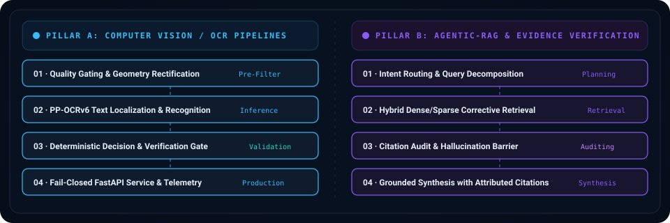

  

## RESEARCH IDENTITY

Computer Science student and AI Systems Engineer focused on building verifiable, production-grade artificial intelligence systems. My research and engineering work centers on two complementary domains:

1. **Computer Vision & OCR Systems**: High-reliability image preprocessing, quality gating, text localization, and fail-closed inference microservices.
2. **Agentic-RAG & Evidence-Verified AI**: Intent routing, multi-hop reasoning, corrective retrieval, and citation-auditing barriers to prevent hallucinations.

I emphasize rigorous empirical evaluation, explicit interface contracts, reproducible benchmarks, and operational reliability over ungrounded black-box models.

  

## FEATURED SYSTEMS

  

### Track 01 — Computer Vision & Document AI

<table>
<tr>
<td width="50%" valign="top">

#### [meter-reading-engine-v2](https://github.com/KwanFam26022005/meter-reading-engine-v2)
Production-grade LCD electricity meter OCR pipeline with automated quality evaluation, geometry rectification, PP-OCRv6 recognition, and deterministic digit validation.

`Python` · `Computer Vision` · `PP-OCRv6` · `Quality Gates`

</td>
<td width="50%" valign="top">

#### [meter-reading-inference-service](https://github.com/KwanFam26022005/meter-reading-inference-service)
FastAPI inference adapter around the frozen meter-reading core, featuring model revision verification, readiness probes, and fail-closed execution policies.

`Python` · `FastAPI` · `Inference API` · `Docker`

</td>
</tr>
<tr>
<td width="50%" valign="top">

#### [meter-reading-pipeline-visualizer](https://github.com/KwanFam26022005/meter-reading-pipeline-visualizer)
Visual telemetry dashboard and interactive stage inspector for the meter-reading pipeline, enabling granular analysis of localization and recognition phases.

`TypeScript` · `React` · `Telemetry` · `Pipeline Inspection`

</td>
<td width="50%" valign="top">

#### [Invoice-engine](https://github.com/KwanFam26022005/Invoice-engine)
Local-first Vietnamese business document intake system with deterministic validation rules, DuckDB persistence, semantic fallbacks, and human review routing.

`Python` · `Document AI` · `DuckDB` · `OCR`

</td>
</tr>
</table>

### Track 02 — Agentic-RAG & Research Systems

<table>
<tr>
<td width="50%" valign="top">

#### [Medical-NLU-Pipeline](https://github.com/KwanFam26022005/Medical-NLU-Pipeline)
Clinical natural language understanding pipeline for medical entity extraction, classification benchmarks, and evidence-grounded semantic parsing.

`Python` · `Clinical NLU` · `NLP` · `Evaluation Benchmarks`

</td>
<td width="50%" valign="top">

#### [tdtu-student-handbook-chatbot](https://github.com/KwanFam26022005/tdtu-student-handbook-chatbot)
Domain-specific institutional assistant using retrieval-augmented generation to answer university handbook and regulatory inquiries with contextual accuracy.

`Python` · `RAG` · `Vector Search` · `LLM Application`

</td>
</tr>
<tr>
<td width="50%" valign="top">

#### KOA Agentic-RAG *(Research Architecture)*
Conceptual multi-agent retrieval framework featuring query decomposition, iterative corrective retrieval, and citation verification barriers for complex multi-hop inquiries.

`Architecture Prototype` · `Agentic AI` · `Evidence Verification`

</td>
<td width="50%" valign="top">

#### [Interactive-Web-Dashboard-for-Frequent-Itemset-Mining](https://github.com/KwanFam26022005/Interactive-Web-Dashboard-for-Frequent-Itemset-Mining-and-Apriori-Pruning-Analysis)
Interactive web platform for frequent-itemset mining, Apriori pruning performance profiling, association rule discovery, and comparative visualization.

`PHP` · `MySQL` · `JavaScript` · `ECharts` · `Apriori`

</td>
</tr>
</table>

## STACK & CAPABILITIES

| Research & Engineering Domain | Technologies & Methodologies |
|---|---|
| **Computer Vision & OCR** | PP-OCRv6 · OpenCV · PyTorch · Image Quality Gating · Localization & Rectification |
| **Agentic-RAG & Verified AI** | Corrective Retrieval (Self-RAG) · Multi-Hop Reasoning · Vector Search · Clinical NLU · Citation Auditing |
| **Data & Persistence** | DuckDB · MySQL · Pandas · Structured Transactional Modeling |
| **Systems & Reliability** | FastAPI · Docker · GitHub Actions Automation · Fail-Closed Inference Boundaries |
| **Web & Instrumentation** | TypeScript · React / Next.js · ECharts · D3.js · PHP |

## LIVE TELEMETRY

  

  

  

