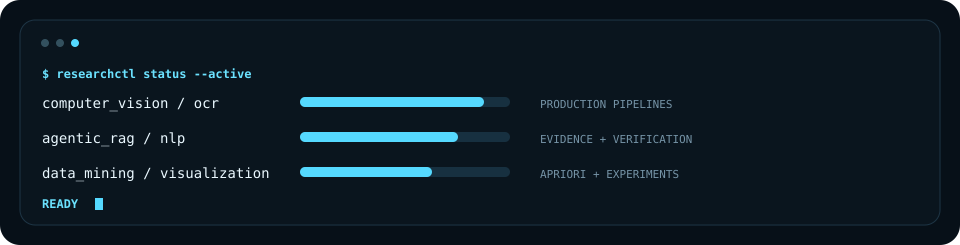

  

  
  
  

## ABOUT THIS NODE

Computer Science student focused on **AI systems, Computer Vision/OCR, applied machine learning, and research-oriented software engineering**. I like turning research questions into systems with explicit contracts, measurable evaluation, reproducible experiments, and production boundaries.

## FEATURED SYSTEMS

<table>
<tr>
<td width="50%" valign="top">

### Meter Reading Engine v2
Production-oriented LCD electricity-meter reading pipeline with explicit quality gates, localization/geometry policies, PP-OCRv6 recognition, validation, centralized decisions, and atomic artifact persistence.

`Python` · `Computer Vision` · `OCR` · `Pipeline Architecture`

[Open repository →](https://github.com/KwanFam26022005/meter-reading-engine-v2)

</td>
<td width="50%" valign="top">

### Meter Reading Inference Service
FastAPI inference and inspection adapter around the frozen meter-reading core, with revision verification, readiness checks, local model policies, safe artifact access, and fail-closed inference readiness.

`Python` · `FastAPI` · `PP-OCRv6` · `Inference API`

[Open repository →](https://github.com/KwanFam26022005/meter-reading-inference-service)

</td>
</tr>
<tr>
<td width="50%" valign="top">

### Universal Invoice Engine
Local-first Vietnamese business-document processing system covering parser routing, evidence-grade intermediate representations, deterministic validation, DuckDB persistence, semantic fallback, and human review.

`Python` · `Document AI` · `DuckDB` · `OCR`

[Open repository →](https://github.com/KwanFam26022005/Invoice-engine)

</td>
<td width="50%" valign="top">

### FIM / Apriori Dashboard
Interactive web project for frequent-itemset mining, Apriori pruning analysis, association rules, performance instrumentation, and visualization-library comparison.

`PHP` · `MySQL` · `JavaScript` · `ECharts` · `Apriori`

[Open repository →](https://github.com/KwanFam26022005/Interactive-Web-Dashboard-for-Frequent-Itemset-Mining-and-Apriori-Pruning-Analysis)

</td>
</tr>
</table>

## LOADED MODULES

| Domain | Working set |
|---|---|
| **AI / ML** | Python · Computer Vision · OCR · NLP · evaluation pipelines |
| **LLM Systems** | RAG · Agentic RAG · evidence verification · corrective retrieval |
| **Data** | MySQL · DuckDB · Pandas · transactional analytics |
| **Systems** | GitHub Actions · reproducible environments · API boundaries · offline-first workflows |
| **Web / Viz** | FastAPI · PHP · JavaScript/TypeScript · Next.js · ECharts · D3.js |

## LIVE TELEMETRY

The panel below is generated from the GitHub API by a scheduled GitHub Action. It updates only when the generated SVG changes.

### Contribution signal

