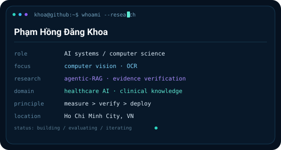
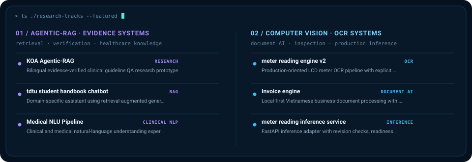

  

  <a href="https://www.linkedin.com/in/pham-hong-dang-khoa-40a3a0379">LinkedIn</a>
  ·
  <a href="mailto:phdk2602@gmail.com">Email</a>
  ·
  Ho Chi Minh City, Vietnam

## `> whoami --research`

<table>
<tr>
<td width="40%" valign="top">
  
</td>
<td width="60%" valign="top">
  
</td>
</tr>
</table>

Tôi xây dựng các hệ thống AI theo hướng **đo được, kiểm chứng được và có ranh giới vận hành rõ ràng**. Hai trục chính hiện tại là **Computer Vision / OCR** và **Agentic-RAG / Evidence Verification**; Healthcare AI là miền ứng dụng nghiên cứu quan trọng, đặc biệt với tri thức lâm sàng và truy xuất có dẫn chứng.

## `> research --active`

<table>
<tr>
<td width="50%" valign="top">

### `01 / COMPUTER VISION · OCR`
- Production-oriented OCR pipelines
- Document AI & inspection
- Quality gates, geometry, validation
- Inference services & visual telemetry

**Current systems:** `meter-reading-engine-v2` · `Invoice-engine` · `meter-reading-inference-service`

</td>
<td width="50%" valign="top">

### `02 / AGENTIC-RAG · EVIDENCE`
- Retrieval with explicit evidence
- Atomic / claim-level verification
- Corrective retrieval & abstention
- Clinical knowledge QA and source awareness

**Research direction:** `KOA Agentic-RAG` · `Medical-NLU-Pipeline` · `tdtu-student-handbook-chatbot`

</td>
</tr>
</table>

## `> ls ./featured-systems`

  

## `> cat ./toolchain`

| Layer | Current stack |
|---|---|
| **Vision / OCR** | Python · PP-OCRv6 · OpenCV · inference pipelines · document inspection |
| **Agentic / NLP** | RAG · evidence verification · retrieval · Clinical NLU |
| **Systems** | FastAPI · Docker · GitHub Actions · fail-closed validation patterns |
| **Data** | DuckDB · MySQL · Pandas |
| **Web / Visualization** | TypeScript · React / Next.js · ECharts · D3.js |

## `> ./profile --activity`

  

  

  

