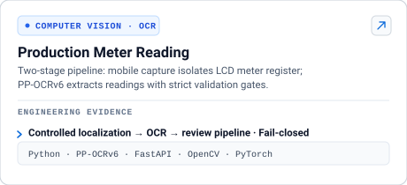
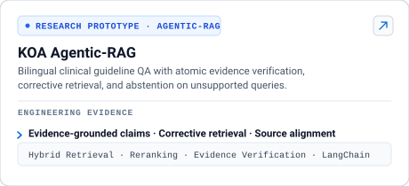
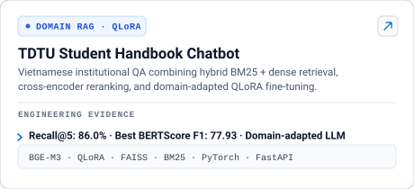
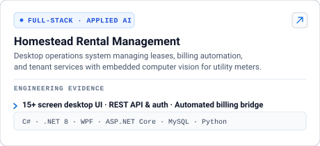
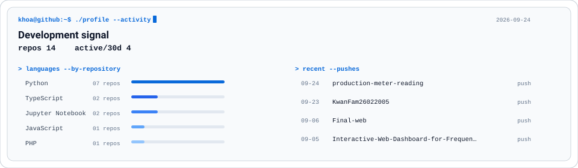
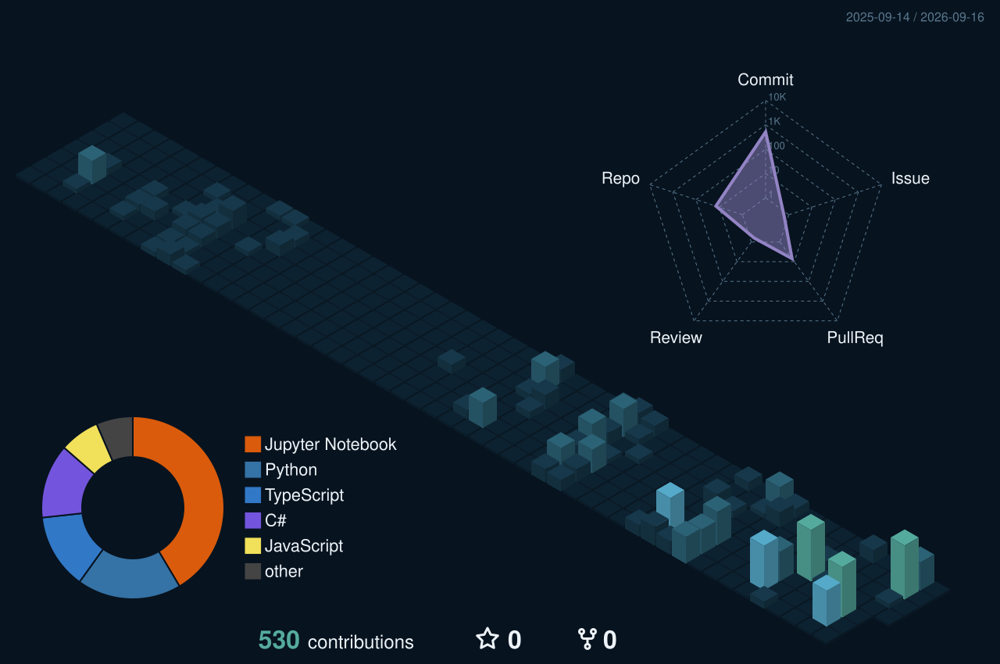
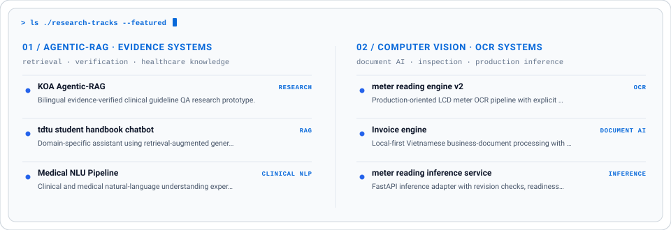

  

  

  <a href="https://www.linkedin.com/in/pham-hong-dang-khoa-40a3a0379">LinkedIn</a>
  ·
  <a href="mailto:phdk2602@gmail.com">Email</a>
  ·
  Ho Chi Minh City, Vietnam

## `> selected-work --impact`

<table>
<tr>
<td width="50%" valign="top">
  
</td>
<td width="50%" valign="top">
  
</td>
</tr>
<tr>
<td width="50%" valign="top">
  
</td>
<td width="50%" valign="top">
  
</td>
</tr>
</table>

## `> about --focus`

I build applied AI systems designed with **measurable benchmarks, verifiable outputs, and explicit operating boundaries**. My primary focus spans **Computer Vision & OCR** (production localization and recognition pipelines) and **Agentic-RAG & Evidence Verification** (retrieval with claim-level validation and abstention). Healthcare informatics serves as a core research domain for knowledge grounding.

## `> stack --core`

| Domain | Technologies & Frameworks | Focus Areas |
|---|---|---|
| **Computer Vision & OCR** | Python · PP-OCRv6 · OpenCV · PyTorch · YOLO | Localization · Digit extraction · Quality gates · Document inspection |
| **Agentic-RAG & NLP** | BGE-M3 · FAISS · BM25 · Cross-Encoder · QLoRA | Hybrid retrieval · Evidence verification · Reranking · Domain fine-tuning |
| **Production AI Systems** | FastAPI · Docker · GitHub Actions · REST APIs | Fail-closed validation · Telemetry · Model serving · Health probes |
| **Software Engineering** | C# · .NET 8 · WPF · ASP.NET Core · TypeScript | Desktop systems · Full-stack architecture · Relational DB (MySQL, DuckDB) |

## `> ./profile --activity`

  

<b>Explore GitHub activity in 3D</b> (profile-ocean-3d terrain)

 

  

## `> more --projects`

  

 

| Repository | Focus Area | Description |
|---|---|---|
| [**Medical-NLU-Pipeline**](https://github.com/KwanFam26022005/Medical-NLU-Pipeline) | Clinical NLP | Clinical natural-language understanding experiments, entity extraction, and evaluation. |
| [**Invoice-engine**](https://github.com/KwanFam26022005/Invoice-engine) | Document AI | Local-first Vietnamese business document processing with deterministic validation. |
| [**meter-reading-inference-service**](https://github.com/KwanFam26022005/meter-reading-inference-service) | Production Inference | FastAPI inference adapter with revision checks, readiness probes, and fail-closed behavior. |
| [**Interactive-Web-Dashboard**](https://github.com/KwanFam26022005/Interactive-Web-Dashboard-for-Frequent-Itemset-Mining) | Data Analytics | Web-based analytics platform for data mining algorithms and interactive visualizations. |

<b>terminal portrait</b> (developer identity)

 

  

  

